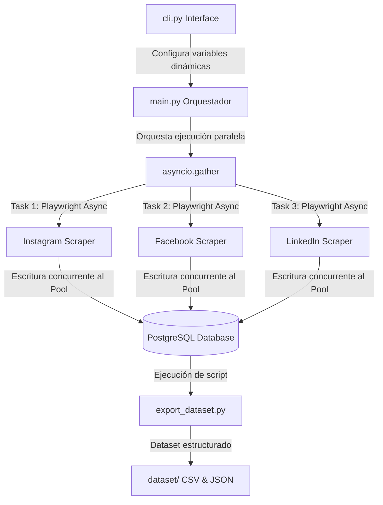

#  Documentación Explicativa de la Práctica 6
## Extracción Masiva y Concurrente de Redes Sociales

Este documento contiene el diseño de ingeniería, la justificación del paralelismo, y la descripción detallada de la problemática abordada para la **Práctica de Laboratorio 06**, cumpliendo de forma rigurosa con los criterios de evaluación especificados en la rúbrica de la materia de Computación Paralela (Universidad Politécnica Salesiana).

---

##  1. Definición Clara de la Problemática (0.7 Puntos)

*   **Tema de Investigación**:  
    *"Impacto emocional de eventos deportivos de interés común en la era digital: análisis de las reacciones públicas ante la Copa Mundial FIFA 2026, UFC y NBA/F1".*

*   **Contexto y Problema Real**:  
    Los eventos deportivos masivos de interés global desatan intensas reacciones emocionales colectivas en tiempo real. Momentos críticos como una victoria in-extremis, una decisión controvertida del VAR (en fútbol), un knock-out espectacular (en UFC) o un adelantamiento arriesgado en la última vuelta (en F1) provocan que millones de personas expresen euforia, enojo, frustración o admiración en redes sociales. 
    
    El problema central radica en **cómo capturar, rastrear y estructurar de manera rápida y eficiente este pulso emocional masivo**. Esto requiere recolectar un gran volumen de opiniones textuales públicas distribuidas en múltiples plataformas sociales al mismo tiempo, manejando la latencia de red y la estructura DOM dinámica propia de las redes sociales.

*   **Estrategia de Búsqueda**:
    Se ha diseñado una interfaz de línea de comandos (CLI) que permite configurar de manera dinámica la estrategia bajo:
    1.  **Palabras Clave y Hashtags**: Búsquedas centralizadas bajo temas unificados de interés como `#fifa`, `#copa2026`, `UFC`, `Copa Mundial`, entre otros.
    2.  **Parámetros Dinámicos**: Límite de tiempo en segundos, comentarios máximos a extraer por cada publicación encontrada, y profundidad de búsqueda en la recolección inicial.

---

##  2. Justificación de las Tres Fuentes Directas/Redes Sociales (0.6 Puntos)

Para obtener un espectro representativo y diverso de opiniones y niveles socio-afectivos, se seleccionaron estas tres fuentes digitales:

1.  **Facebook (WebLite / Mobile Framework)**:
    *   *Justificación*: Permite tomar el pulso a la demografía digital más amplia y general. Históricamente, Facebook alberga comunidades muy activas en grupos públicos de deportes tradicionales y noticias deportivas masivas. Los comentarios tienden a ser coloquiales y a extenderse con argumentos informales sobre rivalidades de selecciones nacionales y equipos de fútbol.
2.  **Instagram (Explore / Search Interface)**:
    *   *Justificación*: Su demografía es predominantemente joven, ávida del contenido micro-informativo e inmediato de organizaciones de deportes como la UFC o la F1. Los comentarios en posts oficiales de deportistas o marcas asociadas capturan el sentimiento emocional más "crudo" e impulsivo en forma de mensajes muy cortos, jergas digitales y abundantes emojis representativos del estado de ánimo inmediato.
3.  **LinkedIn (Content / Feed Search)**:
    *   *Justificación*: Aporta la perspectiva corporativa y profesional de la problemática. En lugar de reacciones viscerales de fanáticos, LinkedIn almacena opiniones y debates racionales acerca del impacto comercial de los eventos (sponsorships, inversiones multimillonarias de marcas en la Copa del Mundo, logística e impacto financiero de la UFC/F1). Con esto, el dataset adquiere un balance maduro e integral de la percepción social.

---

##  3. ESTRATEGIA DE BÚSQUEDA Y DISEÑO DE LA SOLUCIÓN (0.7 Puntos)
La solución está estructurada usando una capa de control CLI (`cli.py`), un orquestador principal asíncrono (`main.py`), scrapers modulares de Playwright por cada red social, y una base de datos relacional PostgreSQL con un pool de conexiones y exportación simplificada.



### Flujo de Operación:
1.  El usuario inicia `cli.py`, define el tema deportivo (ej. "fifa") y un tiempo límite de ejecución.
2.  El motor principal inicializa un pool de base de datos asíncrono PostgreSQL accesible concurrentemente.
3.  Los scrapers de Facebook, Instagram y LinkedIn se instancian concurrentemente mediante `asyncio.gather`. Cada uno abre su respectivo navegador emulado con Playwright, autentica usando cookies previas del módulo `sesiones/`, busca posts del tema, navega internamente y extrae los comentarios agregados al buffer.
4.  Llegado el límite de tiempo u objetivo de posts, se insertan los datos a las tablas relacionales garantizando persistencia inmediata.

---

##  4. IMPLEMENTACIÓN DE EXTRACCIÓN PARALELA O CONCURRENTE (1.2 Puntos)

La concurrencia es implementada directamente utilizando el framework nativo **`asyncio`** de Python a través de la función `asyncio.gather(...)`.

### Fragmento de Código de Orquestación Principal ([main.py]):
El orquestador configura la ejecución concurrente lanzando las tareas asíncronas para las tres redes al mismo tiempo:
```python
# main.py
async def orquestador_principal(tema_busqueda, tiempo_limite_segundos, n_comentarios):
    # ...
    # Definimos la lista de tareas pasando los argumentos dinámicos
    tareas = [
        ejecutar_scraper("Instagram", ig_scraper, tema_busqueda, tiempo_limite_segundos, n_comentarios),
        ejecutar_scraper("Facebook", fb_scraper, tema_busqueda, tiempo_limite_segundos, n_comentarios),
        ejecutar_scraper("LinkedIn", li_scraper, tema_busqueda, tiempo_limite_segundos, n_comentarios),
    ]

    # Ejecuta todo al mismo tiempo de forma concurrente
    await asyncio.gather(*tareas)
    # ...
```

---
