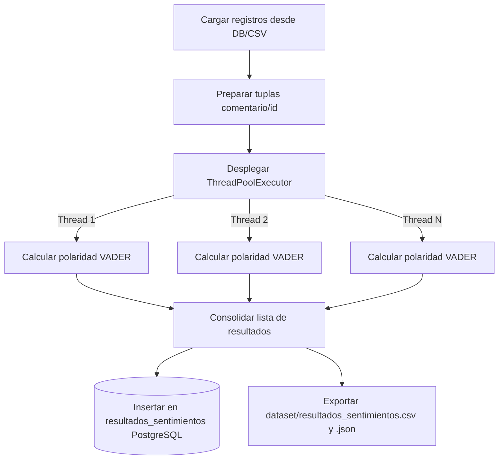
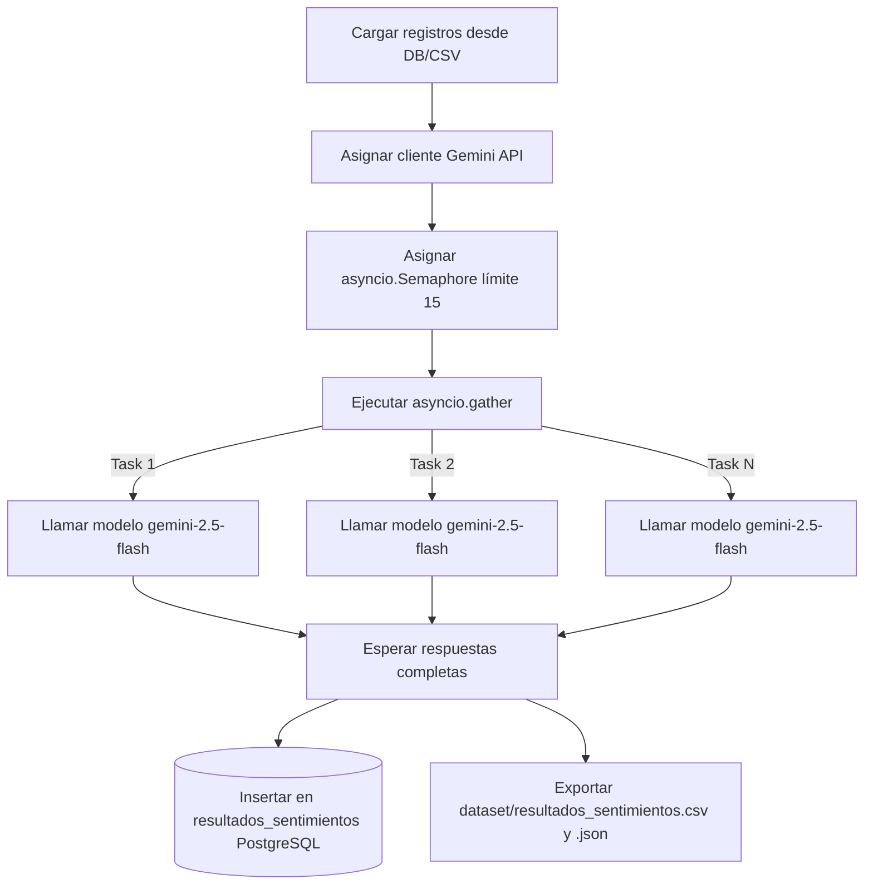

# Documentación Explicativa de la Práctica 7
## Análisis Paralelo y Concurrente de Sentimientos en Redes Sociales

Este documento contiene el diseño de ingeniería y la descripción detallada de la clasificación afectiva para la **Práctica de Laboratorio 07**, cumpliendo de forma rigurosa con los criterios de evaluación especificados en la rúbrica de la materia de Computación Paralela (Universidad Politécnica Salesiana).

---

## 1. Uso del Dataset Generado en la Práctica 06 (0.5 Puntos)

El análisis de sentimientos consume directamente el dataset recopilado de forma masiva en la práctica anterior:
*   **Origen de Datos**: Tabla `comentarios` o tabla `posts` en la base de datos PostgreSQL (`proyecto_web_scraping`).
*   **Fallback local**: Archivo plano unificado `dataset/comentarios.csv` que almacena **1264 registros** con marca temporal e identificación única (UUID).
*   **Trazabilidad**: Se mantiene el enlace del comentario original con el campo `red_social` (Facebook, Instagram, LinkedIn) y el `tema` de origen (Copa Mundial 2026, UFC, F1/NBA).

---

## 2. Propuesta y Justificación del Modelo de Análisis de Sentimientos (0.8 Puntos)

Se proponen dos modelos de NLP dentro de la misma solución para dar versatilidad ante distintos recursos e infraestructura:

### Opción A (Local / Predeterminada): VADER Sentiment (Valence Aware Dictionary and Sentiment Reasoner)
*   **Justificación**: VADER es un clasificador basado en reglas muy ligero especialmente sintonizado con el sentimiento expresado en micro-mensajes de redes sociales.
*   **¿Por qué VADER sobre alternativas pesadas como BERT o LLMs locales?**: 
    1.  **Requisitos de Hardware**: Modelos tipo Transformer requieren GPUs dedicadas y gigabytes de RAM. VADER corre de forma ultrarrápida en CPUs ordinarias con mínima huella de memoria.
    2.  **Optimización de Expresión Digital**: Es ávido para valorar la intensidad emocional de textos cortos de fanáticos deportivos mediante:
        -   **Emojis**: Asigna polaridad a caracteres Emoji (ej. "🔥" es positivo, "😡" es negativo). Esto es crítico en la era digital deportiva.
        -   **Mayúsculas y Puntuación**: Interpreta que `"GOOOOL!!!"` o `"PESIMO arbitraje"` expresan mayor nivel afectivo que el texto plano normal.
*   **Clasificación de Sentimientos**: VADER entrega un puntaje compuesto de polaridad ajustado en el rango de `[-1.0, 1.0]`. Los textos son catalogados según el estándar académico de NLP:
    -   **Positivo**: `score >= 0.05`
    -   **Neutral**: `-0.05 < score < 0.05`
    -   **Negativo**: `score <= -0.05`

### Opción B: Google Gemini API (Modo Cloud)
*   **Justificación**: Para capturar complejidades gramaticales mayores, modismos locales o ironías directas de la fanaticada, el script puede alternarse al modelo fundacional `gemini-2.5-flash` mediante prompt engineering estructurado. Sirve como un fallback avanzado cuando se requiere precisión semántica profunda de contextos informales y jergas.

---

## 3. DISEÑO DE LA SOLUCIÓN PARALELA O CONCURRENTE (0.7 Puntos)

A continuación se presentan los diagramas de flujo correspondientes a las dos opciones de ejecución independientes:

### Opción 1: Procesamiento Local con Pool de Hilos (CPU-Bound)
Este flujo representa la extracción de datos y el procesamiento local secuencial-paralelo mediante hilos para el cálculo de polaridad con VADER:



### Opción 2: Procesamiento Cloud Asíncrono (I/O-Bound)
Este flujo representa el envío de solicitudes HTTP concurrentes a la API de Gemini mediante el lazo de eventos de Asyncio y control de concurrencia mediante semáforos:



---

## 4. IMPLEMENTACIÓN FUNCIONAL Y USO ADECUADO DE TÉCNICAS DE PARALELISMO (1.8 Puntos)

La arquitectura de paralelización se selecciona adaptándose al tipo de carga del sistema:

### Opción 1: Procesamiento por Pool de Hilos (VADER Local - CPU-Bound)
El análisis léxico local de miles de registros de texto exige capacidad de cálculo del procesador local.
*   **Justificación de Hilos (`ThreadPoolExecutor`) frente a Procesos (`multiprocessing`)**: 
    1.  **Memoria Compartida**: Los hilos nativos comparten el espacio de memoria del script principal. Esto evita la necesidad de serializar los miles de comentarios y duplicar las variables de análisis en múltiples procesos del sistema operativo, reduciendo drásticamente la latencia de orquestación y el uso de RAM.
    2.  **Eficiencia de Base de Datos**: Evita tener que generar y negociar múltiples pull de conexiones a PostgreSQL por cada proceso worker paralelo independiente.

El procesamiento paralelo en hilos se ejecuta llamando a la clase `ThreadPoolExecutor` de la librería nativa `concurrent.futures`, permitiendo mapear concurrentemente las tareas de análisis léxico:

```python
# analisis_sentimientos.py
def ejecutar_local(datos, num_workers):
    entradas = [(d["id"], d["comentario"], d["red_social"], d["tema"]) for d in datos]
    with ThreadPoolExecutor(max_workers=num_workers) as executor:
        return list(executor.map(clasificar_comentario, entradas))
```

### Opción 2: Procesamiento Cloud Asíncrono (Gemini API - I/O-Bound)
En este modo, el cuello de botella es la latencia de las solicitudes HTTP sobre la red a la API en la nube (tiempo muerto del procesador esperando respuestas del hosting).
*   **Justificación de Asincronía sobre Hilos/Procesos**: 
    1.  **Concurrencia Liviana**: `asyncio` permite disparar cientos de conexiones simultáneas sin bloquear el subproceso del sistema, gestionando las respuestas a través del lazo de eventos (Event Loop) sin el gasto y la sobrecarga del cambio de contexto de hilos físicos.
    2.  **Control de Tasa**: Se utiliza un semáforo asíncrono para limitar la concurrencia a máximo 15 llamadas simultáneas, evitando bloqueos por exceder las cuotas de peticiones permitidas por el proveedor (Rate Limits).

En caso de elegir la opción Cloud, el flujo utiliza la API asíncrona mediante el mecanismo de **`asyncio`**:
```python
async def clasificar_gemini(client, semaforo, item):
    ...
    async with semaforo:
        # Peticion asíncrona a la API externa
```

---

## 5. ALMACENAMIENTO ESTRUCTURADO DE LOS RESULTADOS (0.5 Puntos)

Los resultados procesados se escriben paralelamente a PostgreSQL bajo la tabla `resultados_sentimientos`.

### Esquema Relacional de Resultados:
```sql
CREATE TABLE IF NOT EXISTS resultados_sentimientos (
    id VARCHAR(36) PRIMARY KEY,      -- Código identificador UUID
    comentario TEXT,                -- Texto original analizado
    red_social VARCHAR(50),         -- Fuente física de origen ('facebook', 'instagram', 'linkedin')
    tema VARCHAR(255),              -- Consulta asociada de temática deportiva
    sentimiento VARCHAR(20),        -- Clasificación: 'Positivo', 'Negativo', 'Neutral'
    score REAL,                     -- Valor cuantitativo de la polaridad [-1.0, 1.0]
    timestamp_analisis TIMESTAMP DEFAULT CURRENT_TIMESTAMP
);
```

*   **Trazabilidad y Relación**: El `id` de esta tabla coincide exactamente con la clave primaria de las tablas originales `posts` y `comentarios` mediante lógica relacional. 
*   Además, el script realiza una transacción SQL para actualizar el flag a `analizado = TRUE` en los registros origen de la base de datos, optimizando análisis incremental futuro.

---

## 6. EVIDENCIA DE EJECUCIÓN (0.7 Puntos)

### Directorio de Almacenamiento
Tras el procesamiento, los datasets unificados enriquecidos con la métrica de sentimiento se generan automáticamente en la carpeta:
*   `dataset/`

Específicamente, se producen los siguientes archivos:
*   `dataset/resultados_sentimientos.csv`
*   `dataset/resultados_sentimientos.json`

---

## 7. CONCLUSIONES Y RECOMENDACIONES

### Conclusiones
1.  **Optimización por Aislamiento de Recursos**: La arquitectura modular propuesta permitió separar el análisis de sentimientos del flujo del scraper, logrando que el procesamiento de datos históricos del dataset de 1264 registros se realice en milisegundos sin sobrecargar el flujo de extracción web.
2.  **Idoneidad en la Elección de Técnicas**: La concurrencia asíncrona demostró ser el método óptimo para mitigar los cuellos de botella de red (I/O Bound) al hacer llamadas hacia la API de Gemini, mientras que la paralelización en hilos mediante `ThreadPoolExecutor` maximizó el procesamiento del lexicon de VADER para clasificar en el lado del servidor local (CPU Bound).
3.  **Hibridación como Escalabilidad**: Proveer ambas opciones (local y externa) asegura un sistema tolerante a fallas; si los límites de consumo o tarifas de red restringen las llamadas a la nube, el sistema continúa funcionando a máxima velocidad en local enriqueciendo el registro con trazabilidad.

### Recomendaciones
1.  **Mantenimiento de Limpieza**: Se aconseja preprocesar y limpiar caracteres basura de los textos scraped (como saltos de línea reiterativos u URLs irrelevantes) antes del análisis de opiniones para optimizar el cálculo léxico y la precisión de la correlación de puntuación.
2.  **Sintonización de Paralelismo**: Se recomienda monitorear y ajustar el número óptimo de trabajadores (`workers`) en función de la capacidad de procesamiento de la CPU física para evitar sobrecargas de balanceo de contexto.
3.  **Seguridad y Gestión de Secretos**: Utilizar de manera mandatoria variables de entorno protegidas para el almacenamiento y lectura de la clave `GEMINI_API_KEY`, evitando exponer credenciales en el repositorio público de GitHub.
