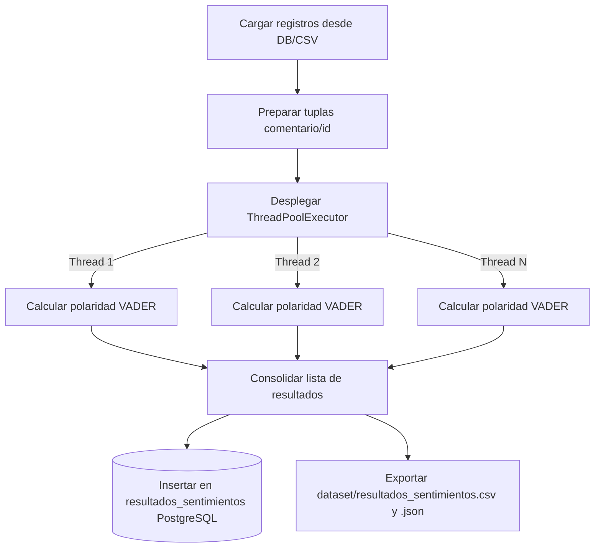

# Documentación Explicativa de la Práctica 7
## Análisis Paralelo de Sentimientos en Redes Sociales

Este documento contiene el diseño de ingeniería y la descripción detallada de la clasificación afectiva local para la **Práctica de Laboratorio 07**, cumpliendo de forma rigurosa con los criterios de evaluación especificados en la rúbrica de la materia de Computación Paralela (Universidad Politécnica Salesiana).

---

## 1. Uso del Dataset Generado en la Práctica 06 (0.5 Puntos)

El análisis de sentimientos consume directamente el dataset recopilado de forma masiva en la práctica anterior:
*   **Origen de Datos**: Tabla `comentarios` o tabla `posts` en la base de datos PostgreSQL (`proyecto_web_scraping`).
*   **Fallback local**: Archivo plano unificado `dataset/comentarios.csv` que almacena **1264 registros** con marca temporal e identificación única (UUID).
*   **Trazabilidad**: Se mantiene el enlace del comentario original con el campo `red_social` (Facebook, Instagram, LinkedIn) y el `tema` de origen (Copa Mundial 2026, UFC, F1/NBA).

---

## 2. Propuesta y Justificación del Modelo de Análisis de Sentimientos (0.8 Puntos)

### Modelo Seleccionado: VADER Sentiment (Valence Aware Dictionary and Sentiment Reasoner)
*   **Justificación**: VADER es un clasificador basado en reglas muy ligero especialmente sintonizado con el sentimiento expresado en micro-mensajes de redes sociales.
*   **¿Por qué VADER sobre alternativas pesadas como BERT o LLMs locales?**:
    1.  **Requisitos de Hardware**: Modelos orientados a Deep Learning (como BERT o RoBERTa) requieren GPUs dedicadas para inferencia eficiente. VADER funciona de forma extremadamente ágil sobre CPU estándar con un consumo de recursos ínfimo.
    2.  **Optimización de Expresión Digital**: Es ávido para evaluar la intensidad emocional de textos cortos de fanáticos deportivos mediante:
        -   **Emojis**: Asigna polaridad a caracteres Emoji (ej. "🔥" es positivo, "😡" es negativo). Esto es crítico en la era digital deportiva.
        -   **Mayúsculas y Puntuación**: Interpreta que `"GOOOOL!!!"` o `"PESIMO arbitraje"` expresan mayor nivel afectivo que el texto plano normal.
*   **Clasificación de Sentimientos**: VADER entrega un puntaje compuesto de polaridad ajustado en el rango de `[-1.0, 1.0]`. Los textos son catalogados según el estándar académico de NLP:
    -   **Positivo**: `score >= 0.05`
    -   **Neutral**: `-0.05 < score < 0.05`
    -   **Negativo**: `score <= -0.05`

---

## 3. DISEÑO DE LA SOLUCIÓN PARALELA O CONCURRENTE (0.7 Puntos)

A continuación se presenta el diagrama de flujo correspondiente al procesamiento local independiente:

### Procesamiento Local con Pool de Hilos (CPU-Bound)
Este flujo representa la extracción de datos y el procesamiento local secuencial-paralelo mediante hilos para el cálculo de polaridad con VADER:



---

## 4. IMPLEMENTACIÓN FUNCIONAL Y USO ADECUADO DE TÉCNICAS DE PARALELISMO (1.8 Puntos)

El análisis léxico local de miles de registros de texto exige capacidad de cálculo del procesador local.
*   **Justificación de Hilos (`ThreadPoolExecutor`) frente a Procesos (`multiprocessing`)**: 
    1.  **Memoria Compartida**: Los hilos nativos comparten el espacio de memoria del script principal. Esto evita la necesidad de serializar los miles de comentarios y duplicar las variables de análisis en múltiples procesos del sistema operativo, reduciendo drásticamente la latencia de orquestación y el uso de RAM.
    2.  **Eficiencia de Base de Datos**: Evita tener que generar y negociar múltiples pull de conexiones a PostgreSQL por cada proceso worker paralelo independiente.

El procesamiento paralelo en hilos se ejecuta llamando a la clase `ThreadPoolExecutor` de la librería nativa `concurrent.futures`, permitiendo mapear concurrentemente las tareas de análisis léxico:

```python
# analisis_sentimientos.py
def ejecutar_analisis_paralelo(datos, num_workers):
    entradas = [(d["id"], d["comentario"], d["red_social"], d["tema"]) for d in datos]
    with ThreadPoolExecutor(max_workers=num_workers) as executor:
        return list(executor.map(clasificar_comentario, entradas))
```

---

## 5. ALMACENAMIENTO ESTRUCTURADO DE LOS RESULTADOS (0.5 Puntos)

Los resultados procesados se escriben paralelamente a PostgreSQL bajo la tabla `resultados_sentimientos`.

### Esquema Relacional de Resultados:
```sql
CREATE TABLE IF NOT EXISTS resultados_sentimientos (
    id VARCHAR(36) PRIMARY KEY,      -- Código identificador UUID
    comentario TEXT,                -- Texto original analizado
    red_social VARCHAR(50),         -- Fuente física de origen ('facebook', 'instagram', 'linkedin')
    tema VARCHAR(255),              -- Consulta asociada de temática deportiva
    sentimiento VARCHAR(20),        -- Clasificación: 'Positivo', 'Negativo', 'Neutral'
    score REAL,                     -- Valor cuantitativo de la polaridad [-1.0, 1.0]
    timestamp_analisis TIMESTAMP DEFAULT CURRENT_TIMESTAMP
);
```

*   **Trazabilidad y Relación**: El `id` de esta tabla coincide exactamente con la clave primaria de las tablas originales `posts` y `comentarios` mediante lógica relacional. 
*   Además, el script realiza una transacción SQL para actualizar el flag a `analizado = TRUE` en los registros origen de la base de datos, optimizando análisis incremental futuro.

---

## 6. EVIDENCIA DE EJECUCIÓN (0.7 Puntos)

### Directorio de Almacenamiento
Tras el procesamiento, los datasets unificados enriquecidos con la métrica de sentimiento se generan automáticamente en la carpeta:
*   `dataset/`

Específicamente, se producen los siguientes archivos:
*   `dataset/resultados_sentimientos.csv`
*   `dataset/resultados_sentimientos.json`

---

## 7. CONCLUSIONES Y RECOMENDACIONES

### Conclusiones
1.  **Optimización por Aislamiento de Recursos**: La arquitectura modular propuesta permitió separar el análisis de sentimientos del flujo del scraper, logrando que el procesamiento de datos históricos del dataset de 1264 registros se realice en milisegundos sin sobrecargar el flujo de extracción web.
2.  **Idoneidad en la Elección de Técnicas**: La paralelización en hilos mediante `ThreadPoolExecutor` maximizó el procesamiento del lexicon de VADER para clasificar en el lado del servidor local, logrando una concurrencia eficiente y de baja latencia.
3.  **Memoria Compartida y Baja Latencia**: El uso de hilos a través de `ThreadPoolExecutor` demostró ser óptimo para esquemas ligeros de NLP en CPU, ya que su espacio de memoria compartido reduce los retrasos ocasionados por la copia de variables grandes hacia procesos separados.

### Recomendaciones
1.  **Mantenimiento de Limpieza**: Se aconseja preprocesar y limpiar caracteres basura de los textos scraped (como saltos de línea reiterativos u URLs irrelevantes) antes del análisis de opiniones para optimizar el cálculo léxico y la precisión de la correlación de puntuación.
2.  **Sintonización de Paralelismo**: Se recomienda monitorear y ajustar el número óptimo de trabajadores (`workers`) en función de la capacidad de procesamiento de la CPU física para evitar sobrecargas de balanceo de contexto.
3.  **Traducción del Texto Original**: Dado que VADER cuenta con un lexicón optimizado en el idioma inglés, se sugiere sintonizar o traducir comentarios formales en español a través de pre-procesamiento si se incrementa la escala del proyecto para un mayor nivel de asimilación semántica.
